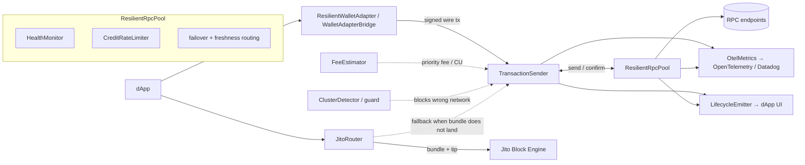

# solana-resilience-kit

[](https://www.npmjs.com/package/solana-resilience-kit)
[](https://www.npmjs.com/package/solana-resilience-kit)
[](https://www.npmjs.com/package/solana-resilience-kit)
[](./.github/workflows/ci.yml)
[](./LICENSE)

A vendor-neutral, **client-side resilience and observability layer for Solana dApps**, built on `@solana/kit` (web3.js v2). It unifies the reliability work that is today either left as a do-it-yourself recipe by the official SDK or locked inside a single provider: health-aware multi-RPC failover, a correct transaction send/confirm state machine, simulate-based fee/CU estimation, Jito/MEV routing with automatic RPC fallback, cluster-mismatch protection, typed lifecycle events, friendly error translation, and standardized OpenTelemetry/Datadog telemetry — behind one clean API that works on top of any set of providers.

> **🔬 Live demo: [solana-resilience-kit.pages.dev](https://solana-resilience-kit.pages.dev/)** — the *RPC Resilience Lab* runs the real SDK in your browser: inject faults against the simulation harness, flip the kit on/off to compare landing rates, or connect a wallet and land a real transaction on devnet. ([source](./demo))

- **Vendor-neutral** — works with any RPC provider; no gateway, no proprietary key required.
- **Correct by construction** — implements the send/confirm semantics most clients get wrong (no double-charge, bounded by `lastValidBlockHeight`).
- **Built on `@solana/kit`** — the pool *is* a kit `RpcTransport`, so it drops into existing kit code.
- **Deterministically tested** — an in-memory fault-injection cluster reproduces drops, expiry, 429s, desync, and MEV failures; 157 specs across 30 files, coverage-gated.
- **Observable & UI-ready** — first-class client telemetry to OpenTelemetry / Datadog, plus a typed, browser-safe lifecycle event stream for dApp UIs.

## Table of contents

- [Problem](#problem)
- [Pain points](#pain-points)
- [Existing solutions & their shortcomings](#existing-solutions--their-shortcomings)
- [Modules](#modules)
- [Architecture](#architecture)
- [Install](#install)
- [Quickstart](#quickstart)
- [Feature guide](#feature-guide)
  - [RPC resilience — pool, health, rate limiting](#rpc-resilience--pool-health-rate-limiting)
  - [Reliable send/confirm](#reliable-sendconfirm)
  - [Confirmation: multi-endpoint fan-out + WebSocket fast-path](#confirmation-multi-endpoint-fan-out--websocket-fast-path)
  - [Cluster guard (wrong-network protection)](#cluster-guard-wrong-network-protection)
  - [Fees & compute-unit estimation](#fees--compute-unit-estimation)
  - [Jito / MEV routing with RPC fallback](#jito--mev-routing-with-rpc-fallback)
  - [Error translation](#error-translation)
  - [Lifecycle events](#lifecycle-events)
  - [Wallet-adapter bridge + React hook](#wallet-adapter-bridge--react-hook)
  - [Observability (OpenTelemetry / Datadog)](#observability-opentelemetry--datadog)
- [Diagnostics CLI](#diagnostics-cli)
- [Correctness invariants](#correctness-invariants)
- [Testing your own code against the fault harness](#testing-your-own-code-against-the-fault-harness)
- [Interactive demo](#interactive-demo)
- [Package entry points](#package-entry-points)
- [Testing & simulation](#testing--simulation)
- [Building from source](#building-from-source)
- [Project layout](#project-layout)
- [API reference](#api-reference)
- [License](#license)

## Problem

Solana's reliability failures are not random bugs — they are direct consequences of four structural facts, and each needs a distinct client-side mitigation:

1. **No mempool.** RPC nodes forward a transaction straight to the upcoming leader over QUIC; there is no shared pending pool, so a dropped transaction leaves no trace and gets no automatic retry. ([Solana — Retry](https://solana.com/developers/guides/advanced/retry))
2. **Blockhash expiry.** A recent blockhash is valid for only ~150 blocks (~60–90 s); after that the transaction is permanently rejected. Re-signing *before* expiry can land both copies and **double-charge the user** — safe resend only happens once block height passes `lastValidBlockHeight`. ([Solana — Confirmation](https://solana.com/developers/guides/advanced/confirmation))
3. **Stake-weighted QoS (SWQoS).** Leaders reserve ~80% of inbound QUIC connections for staked validators and ~20% shared across all unstaked nodes, so unstaked submission is structurally disadvantaged under congestion. ([Helius — SWQoS](https://www.helius.dev/blog/stake-weighted-quality-of-service-everything-you-need-to-know))
4. **Localized fee markets.** Contention attaches to specific write-locked accounts, so a global fee number is a poor proxy for what *your* transaction needs. ([Helius — local fee markets](https://www.helius.dev/blog/solana-local-fee-markets))

These modes are dormant in calm conditions and resurface on every demand spike — the March–April 2024 congestion drove non-vote failure rates near 75%. ([Cointelegraph](https://cointelegraph.com/news/solana-struggling-record-seventy-five-percent-trasnactions-fail-memecoin-mania)) Reliability therefore has to be engineered around each fact explicitly, not treated as best-effort.

## Pain points

| Pain | Who it hits | What this SDK does |
|---|---|---|
| Silent transaction drop (no error, no trace) | end users, dApp devs | `TransactionSender` with bounded rebroadcast and block-height confirmation |
| Blockhash expiry / double-charge on resign | end users, dApp devs | outcome bounded by `lastValidBlockHeight`; never re-signs the transaction |
| 429 / credit exhaustion | anyone on public/shared RPC, indexers, bots | `CreditRateLimiter` (per-method weights) + pool failover |
| Node desync inside an RPC pool | every multi-provider dApp | `HealthMonitor` (slot-freshness ranking), routes to a fresh node |
| Status withheld by a lagging node | multi-provider dApps | multi-endpoint confirmation fan-out + optional WebSocket fast-path |
| Priority-fee / compute-unit estimation | all devs, wallets, traders | `simulate → unitsConsumed + ~10%`, percentile fee oracle |
| MEV / frontrunning | DEX/memecoin swappers, bots | `JitoRouter` + dynamic tip + automatic fallback to RPC |
| Wrong-network send (mainnet tx → devnet) | every dApp, wallets | `ClusterDetector` + cluster guard blocks the send pre-broadcast |
| Opaque RPC/program/wallet errors | end users, support, devs | `ErrorTranslator` → stable code + human message + suggestion |
| No live UI state for sends/connections | frontend engineers | typed `LifecycleEmitter` (`transaction:*` / `connection:*`) |
| Observability blind spot | infra/frontend engineers, wallets | client telemetry exported to OpenTelemetry / Datadog |

## Existing solutions & their shortcomings

The decisive finding: every robust mitigation today is **either a DIY recipe in the official SDK, or locked inside one provider's walled garden.**

| Tool / layer | Solves | Falls short |
|---|---|---|
| **`@solana/kit`** (web3.js v2) | Composable transports, better confirmation primitives, tree-shakable | Failover / round-robin / retry shipped only as **copy-paste recipes**; no Jito routing, no health-aware multi-RPC, no telemetry |
| **Helius / QuickNode / Triton** | Excellent landing (staked send), priority-fee & bundle APIs | **Provider lock-in** — needs their key and their gateway; server-side; doesn't unify across providers |
| **Jito** (bundles, low-latency send) | MEV protection, atomicity, tips | A provider service; a `bundle_id` is a receipt, **not a landing guarantee** — needs fallback + tip logic the dev must build |
| **`@solana/wallet-adapter`** | Wallet connect / sign / send handoff | **No resilience** — failover/retry/confirmation are explicitly the app's job |
| **OSS multi-RPC libs** | Thin failover wrappers | Narrow; none combine retry + confirmation + Jito + observability |
| **OpenTelemetry / Datadog** | Generic JSON-RPC spans, OTLP ingest | **No Solana-specific client instrumentation exists** |

**The white space:** a *vendor-neutral, client-side, systems-grade* layer that unifies all of the above behind one API on top of `@solana/kit` — which is exactly what this package provides.

## Modules

| Module | File | Responsibility |
|---|---|---|
| `ResilientRpcPool` | `src/rpc/pool.ts` | Failover + freshness-aware routing behind one kit `RpcTransport`; per-request metrics & events |
| `HealthMonitor` | `src/rpc/health.ts` | Per-endpoint freshness/latency/error tracking; ejects laggards beyond `maxSlotLag` |
| `CreditRateLimiter` | `src/rpc/rate-limit.ts` | Weighted-credit token bucket to pre-empt 429s |
| `ClusterDetector` | `src/rpc/cluster.ts` | Identify the cluster via genesis hash; guard against sending to the wrong network |
| `TransactionSender` | `src/tx/sender.ts` | Send/confirm state machine: `maxRetries:0`, bounded rebroadcast, **no re-sign** |
| `ConfirmationTracker` | `src/tx/confirmation.ts` | Decides outcome by block height vs `lastValidBlockHeight`; optional multi-endpoint fan-out + WebSocket fast-path |
| `FeeEstimator` + `NativeFeeOracle` / `HeliusFeeOracle` | `src/fees/*` | Simulate-based CU sizing + pluggable percentile fee oracle (native or Helius) |
| `JitoRouter` + `TipEstimator` | `src/jito/*` | Bundle routing, dynamic tips, automatic RPC fallback |
| `ErrorTranslator` | `src/error-translator.ts` | Map raw RPC/program/wallet errors to a stable `code` + actionable `userMessage`/`suggestion` |
| `LifecycleEmitter` (`TypedEventEmitter`) | `src/events.ts` | Typed, browser-safe `transaction:*` / `connection:*` event stream for dApp UIs |
| `OtelMetrics` / `InMemoryMetrics` | `src/observability/metrics.ts` | Client telemetry (latency, failures, slot lag, landings) → OTel/Datadog |
| `ResilientWalletAdapter` | `src/wallet/adapter.ts` | Wallet-signed transactions through the resilient pipeline |
| `WalletAdapterBridge` (+ `useResilientSender`) | `src/wallet/wallet-adapter-bridge.ts`, `src/react/*` | Bridge a standard `@solana/wallet-adapter` signer into the resilient sender + Jito router; optional React hook |
| `Diagnostics` + `solana-resilience-diagnose` CLI | `src/cli/diagnose.ts`, `src/cli/index.ts` | Probe provider health; explain why a transaction did or didn't land |

## Architecture



The pool exposes a real `@solana/kit` `RpcTransport`, so callers build a normal kit RPC with `pool.rpc()` and use it like any other — failover, freshness routing, and metrics happen underneath. The Jito path runs in parallel and **always falls back** to the resilient sender when a bundle does not land.

## Install

```bash
npm install solana-resilience-kit @solana/kit
```

Requires Node ≥ 20. The package is ESM-only and ships compiled JS with type declarations. **`@solana/kit` is a required peer dependency** (`^6.9.0`): install it alongside so your app and the SDK resolve to a *single* kit instance — this keeps kit's branded types (`Address`, `Signature`, `Base64EncodedWireTransaction`, …) compatible across the boundary. `@opentelemetry/api` and `react` are **optional** peers, needed only for `OtelMetrics` and the `./react` hook respectively (see [Package entry points](#package-entry-points)).

## Quickstart

Build a failover pool from two RPC endpoints and use it as a normal kit RPC:

```ts
import { createDefaultRpcTransport } from "@solana/kit";
import { ResilientRpcPool, TransactionSender } from "solana-resilience-kit";

const pool = new ResilientRpcPool({
  endpoints: [
    { name: "primary", transport: createDefaultRpcTransport({ url: PRIMARY_URL }) },
    { name: "backup",  transport: createDefaultRpcTransport({ url: BACKUP_URL }) },
  ],
});

const rpc = pool.rpc();                 // a normal @solana/kit RPC, failover underneath
const slot = await rpc.getSlot().send();
```

Send a signed transaction with correct confirmation semantics:

```ts
const sender = new TransactionSender(rpc);

const result = await sender.sendAndConfirm({
  wireTransaction,        // base64, already signed (from getBase64EncodedWireTransaction)
  signature,              // from getSignatureFromTransaction
  lastValidBlockHeight,   // from the blockhash the tx was built with
});

// result.outcome is "confirmed", "failed" (landed but reverted), or "expired" —
// decided by block height, not a timeout. The sender uses maxRetries:0,
// rebroadcasts the *same* signed bytes, never re-signs (so it can never
// double-charge), and treats a resend error on an already-landed tx as
// non-terminal.
```

> Every example below is also a **runnable recipe** in the [interactive demo's cookbook](https://solana-resilience-kit.pages.dev/) — the code you read there is exactly the code that runs against the in-memory harness.

## Feature guide

### RPC resilience — pool, health, rate limiting

`ResilientRpcPool` wraps N endpoints behind a single kit-compatible transport. On each logical request it routes to the freshest healthy endpoint, fails over to the next on a 429 or transport error, optionally meters weighted credits to pre-empt 429s, and emits per-request metrics and lifecycle events.

```ts
import {
  ResilientRpcPool, HealthMonitor, CreditRateLimiter, InMemoryMetrics,
} from "solana-resilience-kit";

const pool = new ResilientRpcPool({
  endpoints: [
    { name: "primary", transport: primaryTransport },
    { name: "backup",  transport: backupTransport },
  ],
  freshnessAware: true,                          // route to the freshest healthy node (default)
  healthMonitor: new HealthMonitor({ endpointNames: ["primary", "backup"], maxSlotLag: 150n }),
  rateLimiter: new CreditRateLimiter({ creditsPerWindow: 100, windowMs: 1_000 }),
  metrics: new InMemoryMetrics(),
});

pool.health();   // EndpointHealth[]: { name, healthy, slot, latencyMs, errorRate, ... }
```

**`ResilientRpcConfig`**

| Field | Type | Default | Meaning |
|---|---|---|---|
| `endpoints` | `{ name, transport }[]` | — | The endpoints to route across (a kit `RpcTransport` each). |
| `freshnessAware` | `boolean` | `true` | Probe slots and route to the freshest healthy node first. |
| `maxAttempts` | `number` | `endpoints.length` | Max endpoint attempts per logical request. |
| `healthMonitor` | `HealthMonitor` | auto (`maxSlotLag: 150n`) | Shared freshness/latency/error tracker. |
| `rateLimiter` | `CreditRateLimiter` | — | Optional weighted-credit gate (a dry bucket is a soft failover). |
| `metrics` | `Metrics` | — | Sink for per-request telemetry. |
| `events` | `LifecycleEmitter` | — | Emits `connection:failover` / `connection:health`. |

**`HealthMonitor`** ranks endpoints by slot freshness (then latency), and ejects an endpoint that is more than `maxSlotLag` slots (default `150n`) behind the freshest node or that has hit `failureThreshold` consecutive failures (default `3`). `latencyAlpha` (default `0.3`) is the EWMA factor for latency.

**`CreditRateLimiter`** is a lazy token bucket metered by *weighted credits* (providers charge heavy methods more). `DEFAULT_METHOD_WEIGHTS` charges `10` credits for `simulateTransaction`, `getRecentPrioritizationFees`, `getProgramAccounts`, and `getSignaturesForAddress`, and `1` for everything else; override per method via `weights`.

### Reliable send/confirm

`TransactionSender` is the send/confirm state machine. It sends with `maxRetries: 0`, runs its own rebroadcast loop resending the **same signed bytes**, and lets `ConfirmationTracker` decide the outcome by block height — never a timeout.

**`SendConfig`**

| Field | Type | Default | Meaning |
|---|---|---|---|
| `wireTransaction` | `string` | — | Base64 signed wire tx (`getBase64EncodedWireTransaction`). |
| `signature` | `string` | — | The tx signature (`getSignatureFromTransaction`). |
| `lastValidBlockHeight` | `bigint` | — | From the blockhash the tx was built with; bounds the loop. |
| `rebroadcastIntervalMs` | `number` | `1000` | Delay between rebroadcasts. |
| `commitment` | `"confirmed" \| "finalized"` | `"confirmed"` | Confirmation target. |
| `txId` | `string` | `signature` | Stable id for lifecycle events. |

**`SenderDeps`** accepts `sleep` (injected for deterministic tests), `metrics`, `events`, and `clusterGuard` (see [Cluster guard](#cluster-guard-wrong-network-protection)). `sendAndConfirm` returns `SendResult { signature, outcome, slot, rebroadcasts }` where `outcome` is `"confirmed" | "failed" | "expired"`.

### Confirmation: multi-endpoint fan-out + WebSocket fast-path

`ConfirmationTracker` polls a signature to a terminal outcome using the canonical rule (block height vs `lastValidBlockHeight`). Two optional accelerators, both **regression-free** — they can only resolve *earlier*, never extend the loop or override expiry:

- **Multi-endpoint fan-out** (`multiEndpoint`) — polls status across the top-K freshest healthy endpoints (ranked by a shared `HealthMonitor`). A definitive on-chain error from *any* node fails fast; a `confirmed` from *any* node wins; dead endpoints are tolerated. This beats the "status withheld by a lagging node" failure class.
- **WebSocket fast-path** (`subscriptions`) — a `signatureNotifications` subscription races the poll loop and resolves on whichever fires first. Any subscription error or close silently falls back to pure polling.

```ts
import { ConfirmationTracker } from "solana-resilience-kit";

const tracker = new ConfirmationTracker(primaryRpc, {
  subscriptions,                       // optional kit/v2 RpcSubscriptions (WS fast-path)
  multiEndpoint: {                     // optional status fan-out
    endpoints: [{ name: "a", rpc: rpcA }, { name: "b", rpc: rpcB }],
    healthMonitor,                     // ranks the endpoints by freshness
    k: 2,                              // poll the top-2 healthy nodes per round
  },
});

const res = await tracker.track({ signature, lastValidBlockHeight });
// TrackResult { signature, outcome, slot, polls, err? }
```

### Cluster guard (wrong-network protection)

`ClusterDetector` resolves which cluster an RPC points at from its immutable genesis hash (one cached `getGenesisHash` per client). Wire it into the sender via `clusterGuard` to block the classic "mainnet-intended tx sent to devnet" mistake **before any broadcast leaves the client**.

```ts
import { TransactionSender, ClusterDetector } from "solana-resilience-kit";

const sender = new TransactionSender(rpc, {
  clusterGuard: { expected: "mainnet-beta", mode: "throw" }, // "warn" | "throw" (default) | "off"
});
// On a definitive mismatch, sendAndConfirm throws ClusterMismatchError before broadcasting.
// An "unknown" cluster (detection failed) never blocks — a transient lookup failure
// is not turned into a hard error.

const info = await new ClusterDetector().detectFromRpc(rpc); // { cluster, genesisHash }
```

`mode: "warn"` emits `connection:cluster-mismatch` and proceeds; `mode: "throw"` throws `ClusterMismatchError`. Pass a shared `detector` in the config to reuse the cached genesis lookup across senders.

### Fees & compute-unit estimation

`FeeEstimator` turns a transaction into a `(computeUnitLimit, computeUnitPrice)` pair. The CU limit comes from simulation (`unitsConsumed`, with `replaceRecentBlockhash` so a stale blockhash doesn't fail it) plus a safety margin; the price comes from a pluggable `FeeOracle` at the requested percentile level.

```ts
import { FeeEstimator, NativeFeeOracle, HeliusFeeOracle } from "solana-resilience-kit";

const estimator = new FeeEstimator(rpc, new NativeFeeOracle(rpc));
const budget = await estimator.estimate({
  wireTransaction,                 // simulated for unitsConsumed
  writableAccounts,                // accounts the tx write-locks (drives local fee markets)
  level: "high",                   // "min" | "low" | "medium" (default) | "high" | "veryHigh"
  cuMargin: 1.1,                   // +10% safety margin (default)
});
// ComputeBudget { computeUnitLimit, computeUnitPrice, priorityFeeLamports }
```

- **`NativeFeeOracle`** derives micro-lamports-per-CU percentiles from `getRecentPrioritizationFees` (free, backward-looking, no key).
- **`HeliusFeeOracle`** calls Helius `getPriorityFeeEstimate` (account-aware percentiles); construct it with `{ url, apiKey?, fetchImpl? }`. Implement the `FeeOracle` interface to plug in any other provider.

### Jito / MEV routing with RPC fallback

`JitoRouter` submits a transaction as a Jito bundle for MEV protection, polls in-flight status a bounded number of times, and — because a `bundle_id` is a receipt, not a landing guarantee — **automatically falls back** to the resilient RPC `TransactionSender` (same signed bytes, same invariants) if the bundle does not land.

```ts
import { JitoRouter, TipEstimator } from "solana-resilience-kit";

const router = new JitoRouter(jitoEngineClient, new TipEstimator(), sender);
const res = await router.sendWithFallback({
  wireTransaction, signature, lastValidBlockHeight,
  tipPercentile: "p50",            // p25 | p50 (default) | p75 | p95 | p99
  maxBundlePolls: 10,              // status polls before falling back to RPC (default 10)
});
// JitoRouteResult: SendResult & { route: "jito" | "rpc"; bundleId: string | null }
```

`TipEstimator` sizes a tip from live Jito tip-floor percentiles (clamped to the `MIN_TIP_LAMPORTS = 1000` protocol minimum). `JitoEngineClient` is a small interface (`getTipAccounts`, `sendBundle`, `getInflightBundleStatuses`) you implement over your Jito Block Engine client. A Jito-landed bundle returns `outcome: "confirmed"` directly (no RPC status poll, which would falsely expire a tx that was never broadcast to the RPC).

### Error translation

`ErrorTranslator` maps raw, opaque upstream errors (RPC strings, program `Custom` codes rendered as hex, wallet rejections, HTTP 429s) into a friendly, actionable `TranslatedError`. It is **pure, total, and idempotent**: it never throws, does no I/O, and re-translating an already-translated error is a no-op. The same dictionary backs the diagnostics CLI.

```ts
import { ErrorTranslator } from "solana-resilience-kit";

const t = ErrorTranslator.translate(rawError);
// TranslatedError { code, category, userMessage, suggestion, originalError }
```

| `code` | Triggered by (examples) |
|---|---|
| `USER_REJECTED` | "user rejected/denied the request" (wallet popup) |
| `WALLET_NOT_CONNECTED` | "wallet not connected" |
| `NETWORK_MISMATCH` | "wrong network" / "cluster mismatch" |
| `SLIPPAGE_EXCEEDED` | "slippage", program error `0x1771` |
| `INSUFFICIENT_FUNDS` | "insufficient funds", `0x1`, "debit an account but found no record" |
| `BLOCKHASH_EXPIRED` | "block height exceeded", "blockhash not found/expired" |
| `RATE_LIMITED` | HTTP `429`, "too many requests" |
| `SIMULATION_FAILED` | "transaction simulation failed" |
| `UNKNOWN` | anything unmatched (generic fallback) |

Patterns are ordered most-specific-first (e.g. slippage is checked before insufficient-funds so a swap's `0x1771` is never misread).

### Lifecycle events

`LifecycleEmitter` is a dependency-free, browser-safe, **fully typed** event emitter. The SDK emits the same internal signals here (for UIs) that it reports to OpenTelemetry (for infra), so a frontend can render live state without re-deriving it. Subscribing to a key infers the exact payload type; a wrong key or payload is a compile error. A throwing listener is isolated, so a buggy UI handler can never break the send path.

```ts
import { LifecycleEmitter, ResilientRpcPool, TransactionSender } from "solana-resilience-kit";

const events = new LifecycleEmitter();
const off = events.on("transaction:confirmed", ({ slot }) => render(`landed in slot ${slot}`));
events.on("connection:failover", ({ from, to }) => render(`${from} → ${to}`));

const pool = new ResilientRpcPool({ endpoints, events });
const sender = new TransactionSender(pool.rpc(), { events });
// off();  // every on()/once() returns an unsubscribe function
```

Event keys: `transaction:pending` · `transaction:simulated` · `transaction:sent` · `transaction:confirmed` (`+ slot`) · `transaction:failed` (`+ err`) · `transaction:expired`; `connection:failover` (`from`, `to`, `reason`) · `connection:health` (`endpoint`, `healthy`, `slot`) · `connection:cluster-detected` (`cluster`, `genesisHash`) · `connection:cluster-mismatch` (`expected`, `actual`, `genesisHash`).

### Wallet-adapter bridge + React hook

Bring your own `@solana/wallet-adapter` wallet (Phantom, Solflare, Backpack…) and land its signed transactions through the resilient sender — and through Jito with automatic RPC fallback when a router is supplied. `react` and `@solana/wallet-adapter-*` are **optional** peer deps; the React hook lives behind the `solana-resilience-kit/react` subpath so the core bundle stays framework-agnostic.

```ts
import { WalletAdapterBridge } from "solana-resilience-kit";
import {
  getBase64EncodedWireTransaction,
  getSignatureFromTransaction,
} from "@solana/kit";

const bridge = new WalletAdapterBridge({
  wallet,                 // { publicKey, signTransaction, signAllTransactions? }
  sender,                 // TransactionSender (built on a ResilientRpcPool)
  jito: router,           // optional: route via Jito, fall back to RPC
  encode: (signed) => ({  // turn the signed kit tx into wire + signature
    wireTransaction: getBase64EncodedWireTransaction(signed),
    signature: getSignatureFromTransaction(signed),
  }),
});

const result = await bridge.signAndSend(transaction, { lastValidBlockHeight });
// Batch: one approval prompt (signAllTransactions when available), landed in order:
const results = await bridge.signAndSendAll([tx1, tx2], { lastValidBlockHeight });
// A wallet rejection surfaces as a typed USER_REJECTED error (ErrorTranslator).
```

React ergonomic with live status sourced from the lifecycle event stream:

```tsx
import { useWallet } from "@solana/wallet-adapter-react";
import { useResilientSender } from "solana-resilience-kit/react";

function SendButton({ sender, transaction, lastValidBlockHeight }) {
  const wallet = useWallet(); // Phantom / Solflare / Backpack …
  const { signAndSend, status, error, address } = useResilientSender({ wallet, sender });

  return (
    <button
      disabled={!address || status === "pending"}
      onClick={() => signAndSend(transaction, { lastValidBlockHeight })}
    >
      {status === "pending" ? "Sending…" : `Send (${status})`}
      {error ? ` — ${String(error)}` : ""}
    </button>
  );
}
```

`ResilientWalletAdapter` is a thinner, string-based variant (`signAndSend(unsignedWire, lastValidBlockHeight)`) when you don't need the generic/Jito/batch surface of the bridge.

### Observability (OpenTelemetry / Datadog)

The library depends on **only `@opentelemetry/api`** — `OtelMetrics` writes to the *global* OpenTelemetry meter, which is a **no-op until your app registers a real `MeterProvider`** with a reader + exporter. The OTel SDK and OTLP exporter are your application's dependencies, not the SDK's, so you choose the backend. The ~10 lines that make exports real:

```ts
import { metrics } from "@opentelemetry/api";
import { MeterProvider, PeriodicExportingMetricReader } from "@opentelemetry/sdk-metrics";
import { OTLPMetricExporter } from "@opentelemetry/exporter-metrics-otlp-http";
import { OtelMetrics, ResilientRpcPool } from "solana-resilience-kit";

// 1. Register a working MeterProvider — without this, OtelMetrics is inert.
metrics.setGlobalMeterProvider(
  new MeterProvider({
    readers: [
      new PeriodicExportingMetricReader({
        // Reads OTEL_EXPORTER_OTLP_ENDPOINT, e.g. an OTel Collector or the
        // Datadog Agent's OTLP intake (http://localhost:4318).
        exporter: new OTLPMetricExporter(),
        exportIntervalMillis: 10_000,
      }),
    ],
  }),
);

// 2. Hand OtelMetrics to the SDK — now every signal below is exported.
const pool = new ResilientRpcPool({ endpoints, metrics: new OtelMetrics({ serviceName: "my-dapp" }) });
```

Install the exporter side in your app (devtime/runtime, not in this library):

```bash
npm install @opentelemetry/sdk-metrics @opentelemetry/exporter-metrics-otlp-http
```

**For Datadog**, point `OTEL_EXPORTER_OTLP_ENDPOINT` at the Datadog Agent's OTLP endpoint (enable OTLP ingestion in the Agent); no separate Collector needed. `InMemoryMetrics` is a fully-implemented sink (with a `successRate()` helper) for tests and local debugging.

The SDK emits a small, fixed set of client-side instruments:

| Instrument | Type | Attributes | Emitted when |
|---|---|---|---|
| `rpc.request.latency_ms` | histogram | `endpoint`, `method`, `ok` | every RPC request attempt (per endpoint) |
| `rpc.request.failures` | counter | `endpoint`, `method` | a request attempt fails |
| `rpc.rate_limited` | counter | `endpoint` | an attempt is rejected with HTTP 429 |
| `tx.rebroadcasts` | counter | `signature` | the sender rebroadcasts the signed transaction |
| `tx.landings` | counter | `signature`, `outcome`, `slots` | a transaction reaches a terminal outcome (`confirmed` / `expired`) |
| `rpc.endpoint.slot` | gauge | `endpoint` | a `getSlot` response is observed (slot-lag dashboards) |

A runnable end-to-end demo is in [`examples/otel-setup.ts`](./examples/otel-setup.ts): `npm run example:otel` wires `OtelMetrics` into a pool + sender, drives simulated sends against the harness, and exports all six instruments — with a console exporter attached so you see every data point even without a collector running.

## Diagnostics CLI

The package ships an executable, `solana-resilience-diagnose`, built on the same `Diagnostics` core (`src/cli/diagnose.ts`). It answers the two questions an operator asks when a Solana dApp misbehaves — *which of my providers is healthy and freshest?* and *did this transaction land, expire, or is it still pending?* — without writing any code. Run it zero-install with `npx`, or — once the package is a dependency — call `solana-resilience-diagnose` directly (it is on your `node_modules/.bin`):

```bash
# Probe provider health across one or more endpoints (reuses the pool's own
# slot-freshness ranking, so "freshest" matches what routing would pick):
npx -p solana-resilience-kit solana-resilience-diagnose probe \
  --rpc https://api.mainnet-beta.solana.com \
  --rpc https://my-backup.rpc
```

```
ENDPOINT                            HEALTH  SLOT       LATENCY  FRESHEST
https://api.mainnet-beta.solana.com ok      287654812  142ms    *
https://my-backup.rpc               down    -          19ms

Freshest: https://api.mainnet-beta.solana.com  ·  1/2 healthy.
  https://my-backup.rpc: fetch failed
```

```bash
# Explain a transaction's outcome point-in-time (no polling loop): it compares
# the current signature status and block height against lastValidBlockHeight —
# the canonical Solana rule — and never re-signs.
npx -p solana-resilience-kit solana-resilience-diagnose explain \
  --rpc https://api.mainnet-beta.solana.com \
  --sig 5xRe...your-signature \
  --lvbh 287654321
```

```
Signature: 5xRe...your-signature
Verdict: EXPIRED
block height 287654400 exceeded lastValidBlockHeight 287654321; the blockhash
expired before the transaction landed (silent drop or congestion). Rebuild with
a fresh blockhash — do NOT re-sign the same one.
```

| Flag | Command | Meaning |
|---|---|---|
| `--rpc <url>` | both | RPC endpoint URL. Repeat for `probe`; exactly one for `explain`. Accepts `--rpc=<url>` too. |
| `--sig <sig>` | `explain` | Transaction signature to explain. |
| `--lvbh <n>` | `explain` | `lastValidBlockHeight` the transaction was built against. |

**Exit codes:** `0` success · `1` a substantive failure (no healthy endpoint, or an expired transaction) · `2` a usage error. Run with no command, `help`, or `--help` to print usage. The argv parser is a pure, network-free function and is unit-tested in isolation (`test/cli/argv.test.ts`).

## Correctness invariants

Solana correctness is subtle; the SDK is built around these rules (and the test suite enforces every one):

- **Blockhash at `confirmed`; preflight commitment matches the blockhash commitment.**
- **Send with `maxRetries: 0`** and run our own rebroadcast loop — the RPC's generic retry is disabled.
- **The loop is bounded by `lastValidBlockHeight`**, never an arbitrary timeout or poll cap, and never polls forever.
- **Never re-sign or mutate a transaction.** Rebroadcast resends the identical signed bytes; a resend error on an already-landed tx is non-terminal. The outcome is decided solely by block height vs `lastValidBlockHeight` — so there is no double-charge risk.
- **The pool routes by slot freshness** to avoid the "fresh blockhash from an advanced node, sent to a lagging node" silent drop.
- **A Jito `bundle_id` is a receipt, not a landing guarantee** — always fall back to RPC.

## Testing your own code against the fault harness

The deterministic Solana cluster simulator the SDK is tested with is shipped as a secondary entry point, so you can drive *your* code through the same injected faults (drops, expiry, 429s, slot lag) — no network, fully reproducible:

```ts
import { MockCluster, MockEndpoint } from "solana-resilience-kit/testing";
import { createSolanaRpcFromTransport } from "@solana/kit";

const cluster = new MockCluster({ initialBlockHeight: 700n });
const endpoint = new MockEndpoint(cluster, { name: "sim" });
endpoint.faults = { dropRate: 1 };               // silently drop every send
const rpc = createSolanaRpcFromTransport(endpoint.transport);

// ...exercise your sender; advance time deterministically:
cluster.advanceSlots(160);                        // push past lastValidBlockHeight
```

The `solana-resilience-kit/testing` entry also ships `MockJitoEngine` (bundle landing/failure scenarios), `MockSubscriptions` (a `signatureNotifications` stand-in for the WebSocket fast-path), an `EndpointFaultProfile` (drops, 429s, latency ranges, slot lag, offline), a seeded `Rng`, and base58 helpers.

## Interactive demo

**Live at [solana-resilience-kit.pages.dev](https://solana-resilience-kit.pages.dev/)** · source in [`demo/`](./demo)

**RPC Resilience Lab** is a backend-free Vite + React app that runs the *real* SDK in your browser. It has two parts:

- **Lab** — an interactive fault-injection console. In **simulation** mode it drives the fault harness (inject drops / 429s / lag / Jito failure and flip the SDK on/off to compare landing rates against a naive client) with a live pipeline stepper, health cards, telemetry, and the typed lifecycle event stream; in **devnet** mode it connects a standard wallet (`@solana/wallet-adapter`), signs a real transfer, runs it through the resilient sender with a `clusterGuard` and live events, and lands it on devnet with an explorer link.
- **Docs & Examples** — a runnable cookbook covering every feature (failover, reliable send, blockhash expiry, freshness routing, Jito fallback, fee estimation, observability, **cluster guard**, **multi-endpoint + WebSocket confirm**, **lifecycle events**, **error translation**, **wallet bridge**, and testing your own dApp). Each recipe imports the real SDK and runs against the harness in your browser — the code you read is the code that runs.

```bash
cd demo && npm install && npm run dev
```

A headless Node example is in [`examples/devnet-demo.ts`](./examples/devnet-demo.ts) (`npx tsx examples/devnet-demo.ts`).

## Package entry points

| Import | Ships | Needs |
|---|---|---|
| `solana-resilience-kit` | the full SDK (everything above) | `@solana/kit` |
| `solana-resilience-kit/react` | `useResilientSender` hook | `react` (optional peer) |
| `solana-resilience-kit/testing` | the deterministic fault harness | — |

`OtelMetrics` additionally uses the optional `@opentelemetry/api` peer. The core bundle is `sideEffects: false` and tree-shakable.

## Testing & simulation

Solana's failure modes — silent drops, blockhash expiry, 429s, lagging-node desync, MEV — cannot be reproduced reliably against live infrastructure, so the SDK is tested against an in-memory, deterministic model of a Solana cluster that injects exactly these faults.

- **Real `@solana/kit` integration.** Each simulated endpoint exposes a real kit `RpcTransport`; a harness self-test signs an actual kit transaction and verifies our wire-format signature extraction matches `getSignatureFromTransaction` — so web3.js-v2 compatibility is *proven*, not assumed.
- **Manual clock.** Nothing advances unless a test calls `cluster.advanceSlots(n)`, making blockhash-expiry and rebroadcast timing deterministic.
- **Seeded faults.** A seeded PRNG drives drops / 429s / latency / slot lag, so every failing sequence is reproducible.
- **Injected `sleep`.** Time-based loops take a `sleep` dependency; tests pass one that advances the mock clock, so the whole state machine runs instantly and deterministically.

```bash
npm test          # full suite (harness + all modules), 157 specs across 30 files
npm run test:cov  # coverage with the thresholds enforced
npm run typecheck # tsc --noEmit
```

Coverage thresholds (`vitest.config.ts`) are **lines 90 / functions 90 / branches 85 / statements 90**, and the suite passes them. **CI enforces this gate on every push and PR** — the `docker compose run --rm cov` step in [`ci.yml`](./.github/workflows/ci.yml) runs `npm run test:cov`, which exits non-zero (failing the build) if coverage drops below those thresholds. A fully reproducible Docker environment is available via the [`Makefile`](./Makefile):

```bash
make verify   # typecheck + always-green harness/metrics tests, in Docker
make test     # typecheck + full suite, in Docker
make cov      # coverage report (writes ./coverage)
```

## Building from source

```bash
git clone https://github.com/mihailShumilov/solana-resilience-kit.git
cd solana-resilience-kit
npm install
npm run build   # emit dist/ — compiled JS + .d.ts for `.`, `./react`, and `./testing`
```

The published package contains only `dist/`, `README.md`, and `LICENSE`. `prepublishOnly` re-runs typecheck + tests + build before any publish.

## Project layout

```
src/        public API — the SDK modules
test/       behavioral specs + test/harness/ (the simulation cluster)
demo/       RPC Resilience Lab (Vite + React browser app)
examples/   headless OTel + devnet examples
```

## API reference

Full generated TypeDoc for every public type and method is published at **[solana-resilience-kit.pages.dev/api/](https://solana-resilience-kit.pages.dev/api/)** and can be regenerated locally with `npm run docs:api`.

## License

[MIT](./LICENSE)
