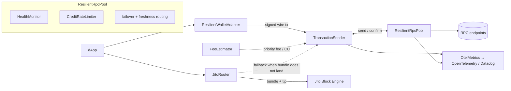

# solana-resilience-kit

[](https://www.npmjs.com/package/solana-resilience-kit)
[](https://www.npmjs.com/package/solana-resilience-kit)
[](https://www.npmjs.com/package/solana-resilience-kit)
[](./LICENSE)

A vendor-neutral, **client-side resilience and observability layer for Solana dApps**, built on `@solana/kit` (web3.js v2). It unifies the reliability work that is today either left as a do-it-yourself recipe by the official SDK or locked inside a single provider: health-aware multi-RPC failover, a correct transaction send/confirm state machine, simulate-based fee/CU estimation, Jito/MEV routing with automatic RPC fallback, and standardized OpenTelemetry/Datadog telemetry — behind one clean API that works on top of any set of providers.

> **🔬 Live demo: [solana-rpc-sdk.pages.dev](https://solana-rpc-sdk.pages.dev)** — the *RPC Resilience Lab* runs the real SDK in your browser: inject faults against the simulation harness, flip the kit on/off to compare landing rates, or connect a wallet and land a real transaction on devnet. ([source](./demo))

- **Vendor-neutral** — works with any RPC provider; no gateway, no proprietary key required.
- **Correct by construction** — implements the send/confirm semantics most clients get wrong (no double-charge, bounded by `lastValidBlockHeight`).
- **Built on `@solana/kit`** — the pool *is* a kit `RpcTransport`, so it drops into existing kit code.
- **Deterministically tested** — an in-memory fault-injection cluster reproduces drops, expiry, 429s, desync, and MEV failures; 102 specs, coverage-gated.
- **Observable** — first-class client telemetry to OpenTelemetry / Datadog.

## Problem

Solana's reliability failures are not random bugs — they are direct consequences of four structural facts, and each needs a distinct client-side mitigation:

1. **No mempool.** RPC nodes forward a transaction straight to the upcoming leader over QUIC; there is no shared pending pool, so a dropped transaction leaves no trace and gets no automatic retry. ([Solana — Retry](https://solana.com/developers/guides/advanced/retry))
2. **Blockhash expiry.** A recent blockhash is valid for only ~150 blocks (~60–90 s); after that the transaction is permanently rejected. Re-signing *before* expiry can land both copies and **double-charge the user** — safe resend only happens once block height passes `lastValidBlockHeight`. ([Solana — Confirmation](https://solana.com/developers/guides/advanced/confirmation))
3. **Stake-weighted QoS (SWQoS).** Leaders reserve ~80% of inbound QUIC connections for staked validators and ~20% shared across all unstaked nodes, so unstaked submission is structurally disadvantaged under congestion. ([Helius — SWQoS](https://www.helius.dev/blog/stake-weighted-quality-of-service-everything-you-need-to-know))
4. **Localized fee markets.** Contention attaches to specific write-locked accounts, so a global fee number is a poor proxy for what *your* transaction needs. ([Helius — local fee markets](https://www.helius.dev/blog/solana-local-fee-markets))

These modes are dormant in calm conditions and resurface on every demand spike — the March–April 2024 congestion drove non-vote failure rates near 75%. ([Cointelegraph](https://cointelegraph.com/news/solana-struggling-record-seventy-five-percent-trasnactions-fail-memecoin-mania)) Reliability therefore has to be engineered around each fact explicitly, not treated as best-effort.

## Pain points

| Pain | Who it hits | What this SDK does |
|---|---|---|
| Silent transaction drop (no error, no trace) | end users, dApp devs | `TransactionSender` with bounded rebroadcast and block-height confirmation |
| Blockhash expiry / double-charge on resign | end users, dApp devs | outcome bounded by `lastValidBlockHeight`; never re-signs the transaction |
| 429 / credit exhaustion | anyone on public/shared RPC, indexers, bots | `CreditRateLimiter` (per-method weights) + pool failover |
| Node desync inside an RPC pool | every multi-provider dApp | `HealthMonitor` (slot-freshness ranking), routes to a fresh node |
| Priority-fee / compute-unit estimation | all devs, wallets, traders | `simulate → unitsConsumed + ~10%`, percentile fee oracle |
| MEV / frontrunning | DEX/memecoin swappers, bots | `JitoRouter` + dynamic tip + automatic fallback to RPC |
| Observability blind spot | infra/frontend engineers, wallets | client telemetry exported to OpenTelemetry / Datadog |

## Existing solutions & their shortcomings

The decisive finding: every robust mitigation today is **either a DIY recipe in the official SDK, or locked inside one provider's walled garden.**

| Tool / layer | Solves | Falls short |
|---|---|---|
| **`@solana/kit`** (web3.js v2) | Composable transports, better confirmation primitives, tree-shakable | Failover / round-robin / retry shipped only as **copy-paste recipes**; no Jito routing, no health-aware multi-RPC, no telemetry |
| **Helius / QuickNode / Triton** | Excellent landing (staked send), priority-fee & bundle APIs | **Provider lock-in** — needs their key and their gateway; server-side; doesn't unify across providers |
| **Jito** (bundles, low-latency send) | MEV protection, atomicity, tips | A provider service; a `bundle_id` is a receipt, **not a landing guarantee** — needs fallback + tip logic the dev must build |
| **`@solana/wallet-adapter`** | Wallet connect / sign / send handoff | **No resilience** — failover/retry/confirmation are explicitly the app's job |
| **OSS multi-RPC libs** | Thin failover wrappers | Narrow; none combine retry + confirmation + Jito + observability |
| **OpenTelemetry / Datadog** | Generic JSON-RPC spans, OTLP ingest | **No Solana-specific client instrumentation exists** |

**The white space:** a *vendor-neutral, client-side, systems-grade* layer that unifies all of the above behind one API on top of `@solana/kit` — which is exactly what this package provides.

## Modules

| Module | File | Responsibility |
|---|---|---|
| `ResilientRpcPool` | `src/rpc/pool.ts` | Failover + freshness-aware routing behind one kit `RpcTransport`; per-request metrics |
| `HealthMonitor` | `src/rpc/health.ts` | Per-endpoint freshness/latency/error tracking; ejects laggards beyond `maxSlotLag` |
| `CreditRateLimiter` | `src/rpc/rate-limit.ts` | Weighted-credit token bucket to pre-empt 429s |
| `TransactionSender` | `src/tx/sender.ts` | Send/confirm state machine: `maxRetries:0`, bounded rebroadcast, **no re-sign** |
| `ConfirmationTracker` | `src/tx/confirmation.ts` | Decides outcome by block height vs `lastValidBlockHeight`, never polls forever |
| `FeeEstimator` + `NativeFeeOracle` / `HeliusFeeOracle` | `src/fees/*` | Simulate-based CU sizing + pluggable percentile fee oracle (native or Helius) |
| `JitoRouter` + `TipEstimator` | `src/jito/*` | Bundle routing, dynamic tips, automatic RPC fallback |
| `OtelMetrics` / `InMemoryMetrics` | `src/observability/metrics.ts` | Client telemetry (latency, failures, slot lag, landings) → OTel/Datadog |
| `ResilientWalletAdapter` | `src/wallet/adapter.ts` | Wallet-signed transactions through the resilient pipeline |
| `Diagnostics` + `solana-resilience-diagnose` CLI | `src/cli/diagnose.ts`, `src/cli/index.ts` | Probe provider health; explain why a transaction did or didn't land (see [Diagnostics CLI](#diagnostics-cli)) |

## Architecture



The pool exposes a real `@solana/kit` `RpcTransport`, so callers build a normal kit RPC with `pool.rpc()` and use it like any other — failover, freshness routing, and metrics happen underneath. The Jito path runs in parallel and **always falls back** to the resilient sender when a bundle does not land.

## Install

```bash
npm install solana-resilience-kit @solana/kit
```

Requires Node ≥ 20. The package is ESM-only and ships compiled JS with type declarations. `@solana/kit` is a peer of your app and is used directly in the API surface.

## Quickstart

Build a failover pool from two RPC endpoints and use it as a normal kit RPC:

```ts
import { createDefaultRpcTransport } from "@solana/kit";
import { ResilientRpcPool, TransactionSender } from "solana-resilience-kit";

const pool = new ResilientRpcPool({
  endpoints: [
    { name: "primary", transport: createDefaultRpcTransport({ url: PRIMARY_URL }) },
    { name: "backup",  transport: createDefaultRpcTransport({ url: BACKUP_URL }) },
  ],
});

const rpc = pool.rpc();                 // a normal @solana/kit RPC, failover underneath
const slot = await rpc.getSlot().send();
```

Send a signed transaction with correct confirmation semantics:

```ts
const sender = new TransactionSender(rpc);

const result = await sender.sendAndConfirm({
  wireTransaction,        // base64, already signed (from getBase64EncodedWireTransaction)
  signature,              // from getSignatureFromTransaction
  lastValidBlockHeight,   // from the blockhash the tx was built with
});

// result.outcome is "confirmed" or "expired" — decided by block height,
// not a timeout. The sender uses maxRetries:0, rebroadcasts the *same*
// signed bytes, never re-signs (so it can never double-charge), and treats a
// resend error on an already-landed tx as non-terminal.
```

## Diagnostics CLI

The package ships an executable, `solana-resilience-diagnose`, built on the same
`Diagnostics` core (`src/cli/diagnose.ts`). It answers the two questions an
operator asks when a Solana dApp misbehaves — *which of my providers is healthy
and freshest?* and *did this transaction land, expire, or is it still pending?* —
without writing any code. Run it zero-install with `npx`, or — once the package
is a dependency — call `solana-resilience-diagnose` directly (it is on your
`node_modules/.bin`):

```bash
# Probe provider health across one or more endpoints (reuses the pool's own
# slot-freshness ranking, so "freshest" matches what routing would pick):
npx -p solana-resilience-kit solana-resilience-diagnose probe \
  --rpc https://api.mainnet-beta.solana.com \
  --rpc https://my-backup.rpc
```

```
ENDPOINT                            HEALTH  SLOT       LATENCY  FRESHEST
https://api.mainnet-beta.solana.com ok      287654812  142ms    *
https://my-backup.rpc               down    -          19ms

Freshest: https://api.mainnet-beta.solana.com  ·  1/2 healthy.
  https://my-backup.rpc: fetch failed
```

```bash
# Explain a transaction's outcome point-in-time (no polling loop): it compares
# the current signature status and block height against lastValidBlockHeight —
# the canonical Solana rule — and never re-signs.
npx -p solana-resilience-kit solana-resilience-diagnose explain \
  --rpc https://api.mainnet-beta.solana.com \
  --sig 5xRe...your-signature \
  --lvbh 287654321
```

```
Signature: 5xRe...your-signature
Verdict: EXPIRED
block height 287654400 exceeded lastValidBlockHeight 287654321; the blockhash
expired before the transaction landed (silent drop or congestion). Rebuild with
a fresh blockhash — do NOT re-sign the same one.
```

| Flag | Command | Meaning |
|---|---|---|
| `--rpc <url>` | both | RPC endpoint URL. Repeat for `probe`; exactly one for `explain`. Accepts `--rpc=<url>` too. |
| `--sig <sig>` | `explain` | Transaction signature to explain. |
| `--lvbh <n>` | `explain` | `lastValidBlockHeight` the transaction was built against. |

**Exit codes:** `0` success · `1` a substantive failure (no healthy endpoint, or an
expired transaction) · `2` a usage error. Run with no command, `help`, or
`--help` to print usage. The argv parser is a pure, network-free function and is
unit-tested in isolation (`test/cli/argv.test.ts`).

## Testing your own code against the fault harness

The deterministic Solana cluster simulator the SDK is tested with is shipped as a
secondary entry point, so you can drive *your* code through the same injected
faults (drops, expiry, 429s, slot lag) — no network, fully reproducible:

```ts
import { MockCluster, MockEndpoint } from "solana-resilience-kit/testing";
import { createSolanaRpcFromTransport } from "@solana/kit";

const cluster = new MockCluster({ initialBlockHeight: 700n });
const endpoint = new MockEndpoint(cluster, { name: "sim" });
endpoint.faults = { dropRate: 1 };               // silently drop every send
const rpc = createSolanaRpcFromTransport(endpoint.transport);

// ...exercise your sender; advance time deterministically:
cluster.advanceSlots(160);                        // push past lastValidBlockHeight
```

## Interactive demo

**Live at [solana-rpc-sdk.pages.dev](https://solana-rpc-sdk.pages.dev)** · source in [`demo/`](./demo)

**RPC Resilience Lab** is a backend-free Vite + React app that runs the *real* SDK in your browser. In **simulation** mode it drives the fault harness (inject drops / 429s / lag / Jito failure and flip the SDK on/off to compare landing rates against a naive client); in **devnet** mode it connects a standard wallet (`@solana/wallet-adapter`), signs a real transfer, and lands it through the SDK with an explorer link.

```bash
cd demo && npm install && npm run dev
```

A headless Node example is in [`examples/devnet-demo.ts`](./examples/devnet-demo.ts) (`npx tsx examples/devnet-demo.ts`).

## Testing & simulation

Solana's failure modes — silent drops, blockhash expiry, 429s, lagging-node desync, MEV — cannot be reproduced reliably against live infrastructure, so the SDK is tested against an in-memory, deterministic model of a Solana cluster that injects exactly these faults.

- **Real `@solana/kit` integration.** Each simulated endpoint exposes a real kit `RpcTransport`; a harness self-test signs an actual kit transaction and verifies our wire-format signature extraction matches `getSignatureFromTransaction` — so web3.js-v2 compatibility is *proven*, not assumed.
- **Manual clock.** Nothing advances unless a test calls `cluster.advanceSlots(n)`, making blockhash-expiry and rebroadcast timing deterministic.
- **Seeded faults.** A seeded PRNG drives drops / 429s / latency / slot lag, so every failing sequence is reproducible.
- **Injected `sleep`.** Time-based loops take a `sleep` dependency; tests pass one that advances the mock clock, so the whole state machine runs instantly and deterministically.

```bash
npm test          # full suite (harness + all modules), 102 specs
npm run test:cov  # coverage with the thresholds enforced
npm run typecheck # tsc --noEmit
```

Coverage thresholds (`vitest.config.ts`) are **lines 90 / functions 90 / branches 85 / statements 90**, and the suite passes them. A fully reproducible Docker environment is available via the [`Makefile`](./Makefile):

```bash
make verify   # typecheck + always-green harness/metrics tests, in Docker
make test     # typecheck + full suite, in Docker
make cov      # coverage report (writes ./coverage)
```

## Building from source

```bash
npm run build   # emit dist/ — compiled JS + .d.ts for `.` and `./testing`
```

The published package contains only `dist/`, `README.md`, and `LICENSE`. `prepublishOnly` re-runs typecheck + tests + build before any publish.

## Project layout

```
src/        public API — the SDK modules
test/       behavioral specs + test/harness/ (the simulation cluster)
demo/       RPC Resilience Lab (Vite + React browser app)
examples/   headless devnet example
```

## License

[MIT](./LICENSE)
</content>
</invoke>
