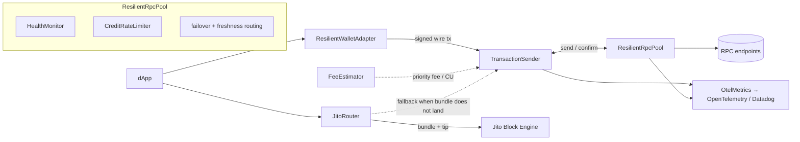

# solana-resilience-kit

A vendor-neutral, **client-side resilience and observability layer for Solana dApps**, built on `@solana/kit` (web3.js v2). It unifies the reliability work that is today either left as a do-it-yourself recipe by the official SDK or locked inside a single provider: health-aware multi-RPC failover, a correct transaction send/confirm state machine, simulate-based fee/CU estimation, Jito/MEV routing with automatic RPC fallback, and standardized OpenTelemetry/Datadog telemetry — behind one clean API that works on top of any set of providers.

> Built for the Superteam Ukraine bounty. The full problem analysis with sources is in [`01_PROBLEM_ANALYSIS.md`](./01_PROBLEM_ANALYSIS.md) (English) / [`01_PROBLEM_ANALYSIS_RU.md`](./01_PROBLEM_ANALYSIS_RU.md) (Russian).

## Problem

Solana's reliability failures are not random bugs — they are direct consequences of four structural facts, and each needs a distinct client-side mitigation:

1. **No mempool.** RPC nodes forward a transaction straight to the upcoming leader over QUIC; there is no shared pending pool, so a dropped transaction leaves no trace and gets no automatic retry. ([Solana — Retry](https://solana.com/developers/guides/advanced/retry))
2. **Blockhash expiry.** A recent blockhash is valid for only ~150 blocks (~60–90 s); after that the transaction is permanently rejected. Re-signing *before* expiry can land both copies and **double-charge the user** — safe resend only happens once block height passes `lastValidBlockHeight`. ([Solana — Confirmation](https://solana.com/developers/guides/advanced/confirmation))
3. **Stake-weighted QoS (SWQoS).** Leaders reserve ~80% of inbound QUIC connections for staked validators and ~20% shared across all unstaked nodes, so unstaked submission is structurally disadvantaged under congestion. ([Helius — SWQoS](https://www.helius.dev/blog/stake-weighted-quality-of-service-everything-you-need-to-know))
4. **Localized fee markets.** Contention attaches to specific write-locked accounts, so a global fee number is a poor proxy for what *your* transaction needs. ([Helius — local fee markets](https://www.helius.dev/blog/solana-local-fee-markets))

These modes are dormant in calm conditions and resurface on every demand spike — the March–April 2024 congestion drove non-vote failure rates near 75%. ([Cointelegraph](https://cointelegraph.com/news/solana-struggling-record-seventy-five-percent-trasnactions-fail-memecoin-mania)) Reliability therefore has to be engineered around each fact explicitly, not treated as best-effort.

## Pain points

| Pain | Who it hits | What this SDK does |
|---|---|---|
| Silent transaction drop (no error, no trace) | end users, dApp devs | `TransactionSender` with bounded rebroadcast and block-height confirmation |
| Blockhash expiry / double-charge on resign | end users, dApp devs | outcome bounded by `lastValidBlockHeight`; never re-signs the transaction |
| 429 / credit exhaustion | anyone on public/shared RPC, indexers, bots | `CreditRateLimiter` (per-method weights) + pool failover |
| Node desync inside an RPC pool | every multi-provider dApp | `HealthMonitor` (slot-freshness ranking), routes to a fresh node |
| Priority-fee / compute-unit estimation | all devs, wallets, traders | `simulate → unitsConsumed + ~10%`, percentile fee oracle |
| MEV / frontrunning | DEX/memecoin swappers, bots | `JitoRouter` + dynamic tip + automatic fallback to RPC |
| Observability blind spot | infra/frontend engineers, wallets | client telemetry exported to OpenTelemetry / Datadog |

## Existing solutions & their shortcomings

The decisive finding: every robust mitigation today is **either a DIY recipe in the official SDK, or locked inside one provider's walled garden.**

| Tool / layer | Solves | Falls short |
|---|---|---|
| **`@solana/kit`** (web3.js v2) | Composable transports, better confirmation primitives, tree-shakable | Failover / round-robin / retry shipped only as **copy-paste recipes**; no Jito routing, no health-aware multi-RPC, no telemetry |
| **Helius / QuickNode / Triton** | Excellent landing (staked send), priority-fee & bundle APIs | **Provider lock-in** — needs their key and their gateway; server-side; doesn't unify across providers |
| **Jito** (bundles, low-latency send) | MEV protection, atomicity, tips | A provider service; a `bundle_id` is a receipt, **not a landing guarantee** — needs fallback + tip logic the dev must build |
| **`@solana/wallet-adapter`** | Wallet connect / sign / send handoff | **No resilience** — failover/retry/confirmation are explicitly the app's job |
| **OSS multi-RPC libs** | Thin failover wrappers | Narrow; none combine retry + confirmation + Jito + observability |
| **OpenTelemetry / Datadog** | Generic JSON-RPC spans, OTLP ingest | **No Solana-specific client instrumentation exists** |

**The white space:** a *vendor-neutral, client-side, systems-grade* layer that unifies all of the above behind one API on top of `@solana/kit` — which is exactly what this repo builds.

## What this repo does

| Module | File | Responsibility |
|---|---|---|
| `ResilientRpcPool` | `src/rpc/pool.ts` | Failover + freshness-aware routing behind one kit `RpcTransport`; per-request metrics |
| `HealthMonitor` | `src/rpc/health.ts` | Per-endpoint freshness/latency/error tracking; ejects laggards beyond `maxSlotLag` |
| `CreditRateLimiter` | `src/rpc/rate-limit.ts` | Weighted-credit token bucket to pre-empt 429s |
| `TransactionSender` | `src/tx/sender.ts` | Send/confirm state machine: `maxRetries:0`, bounded rebroadcast, **no re-sign** |
| `ConfirmationTracker` | `src/tx/confirmation.ts` | Decides outcome by block height vs `lastValidBlockHeight`, never polls forever |
| `FeeEstimator` + `NativeFeeOracle` | `src/fees/*` | Simulate-based CU sizing + pluggable percentile fee oracle |
| `JitoRouter` + `TipEstimator` | `src/jito/*` | Bundle routing, dynamic tips, automatic RPC fallback |
| `OtelMetrics` / `InMemoryMetrics` | `src/observability/metrics.ts` | Client telemetry (latency, failures, slot lag, landings) → OTel/Datadog |
| `ResilientWalletAdapter` | `src/wallet/adapter.ts` | Wallet-signed transactions through the resilient pipeline |
| `Diagnostics` | `src/cli/diagnose.ts` | Probe provider health; explain why a transaction did or didn't land |

## Architecture



The pool exposes a real `@solana/kit` `RpcTransport`, so callers build a normal kit RPC with `pool.rpc()` and use it like any other — failover, freshness routing, and metrics happen underneath. The Jito path runs in parallel and **always falls back** to the resilient sender when a bundle does not land.

## Quickstart

```bash
npm install solana-resilience-kit @solana/kit
```

Build a failover pool from two RPC endpoints and use it as a normal kit RPC:

```ts
import { createDefaultRpcTransport } from "@solana/kit";
import { ResilientRpcPool, TransactionSender } from "solana-resilience-kit";

const pool = new ResilientRpcPool({
  endpoints: [
    { name: "primary", transport: createDefaultRpcTransport({ url: PRIMARY_URL }) },
    { name: "backup",  transport: createDefaultRpcTransport({ url: BACKUP_URL }) },
  ],
});

const rpc = pool.rpc();                 // a normal @solana/kit RPC, failover underneath
const slot = await rpc.getSlot().send();
```

Send a signed transaction with correct confirmation semantics:

```ts
const sender = new TransactionSender(rpc);

const result = await sender.sendAndConfirm({
  wireTransaction,        // base64, already signed (from getBase64EncodedWireTransaction)
  signature,              // from getSignatureFromTransaction
  lastValidBlockHeight,   // from the blockhash the tx was built with
});

// result.outcome is "confirmed" or "expired" — decided by block height,
// not a timeout. The sender uses maxRetries:0, rebroadcasts the *same*
// signed bytes, and never re-signs (so it can never double-charge).
```

## Testing & simulation

Solana's failure modes — silent drops, blockhash expiry, 429s, lagging-node desync, MEV — cannot be reproduced reliably against live infrastructure, so the SDK is tested against an in-memory, deterministic model of a Solana cluster that injects exactly these faults.

- **Real `@solana/kit` integration.** Each simulated endpoint exposes a real kit `RpcTransport`; a harness self-test signs an actual kit transaction and verifies our wire-format signature extraction matches `getSignatureFromTransaction` — so web3.js-v2 compatibility is *proven*, not assumed.
- **Manual clock.** Nothing advances unless a test calls `cluster.advanceSlots(n)`, making blockhash-expiry and rebroadcast timing deterministic.
- **Seeded faults.** A seeded PRNG drives drops / 429s / latency / slot lag, so every failing sequence is reproducible.
- **Injected `sleep`.** Time-based loops take a `sleep` dependency; tests pass one that advances the mock clock, so the whole state machine runs instantly and deterministically.

```bash
npm test          # full suite (harness + all modules)
npm run test:cov  # coverage with the 90% thresholds enforced
npm run typecheck # tsc --noEmit
```

Coverage thresholds (`vitest.config.ts`) are **lines 90 / functions 90 / branches 85 / statements 90**, and the suite passes them — the fault-injection harness is both the path to coverage and the evidence behind the correctness/resilience claims. A fully reproducible Docker environment is available via `make verify` / `make test` (see [§6 of the build playbook](./CLAUDE_CODE_BUILD_PLAYBOOK.md)).

## Mapping to the bounty

| Submission item | Implemented in | Covered by |
|---|---|---|
| web3.js v2.0 / kit compatibility | every module builds on kit's `RpcTransport` | `test/harness/harness.test.ts` (real kit signing) |
| Wallet adapter integration | `ResilientWalletAdapter` | `test/wallet/adapter.test.ts` |
| MEV routing + automatic RPC fallback | `JitoRouter` / `TipEstimator` | `test/jito/router.test.ts`, `test/jito/tips.test.ts` |
| Dynamic fee / CU estimation | `FeeEstimator` / `NativeFeeOracle` | `test/fees/estimator.test.ts` |
| Traffic distribution across healthy nodes | `ResilientRpcPool` / `HealthMonitor` / `CreditRateLimiter` | `test/rpc/{pool,health,rate-limit}.test.ts` |
| Correct send/confirm (no double-charge) | `TransactionSender` / `ConfirmationTracker` | `test/tx/{sender,confirmation}.test.ts` |
| Export metrics to OpenTelemetry / Datadog | `OtelMetrics` | `test/observability/otel.test.ts` |
| Diagnostics CLI | `Diagnostics` (`src/cli/diagnose.ts`) | `test/cli/diagnose.test.ts` |
| 90%+ coverage via network-fault simulation | fault-injection harness (`test/harness`) | enforced in `vitest.config.ts` |

## Status

| Layer | State |
|---|---|
| Simulation harness (`test/harness`) | ✅ implemented + self-tested |
| RPC layer (pool, health, rate limit) | ✅ implemented + tested |
| Transaction layer (sender, confirmation) | ✅ implemented + tested |
| Fees (estimator, native oracle) | ✅ implemented + tested |
| Jito (router, tip estimator) | ✅ implemented + tested |
| Observability (OTel exporter) | ✅ implemented + tested |
| Wallet adapter | ✅ implemented + tested |
| Diagnostics CLI core | ✅ implemented + tested |
| Coverage gate (90%) | ✅ passing |
| Live devnet example | ⏳ planned (`examples/devnet-demo.ts`) |
| `HeliusFeeOracle` HTTP oracle | ⏳ interface in place, implementation pending |

## License

MIT
